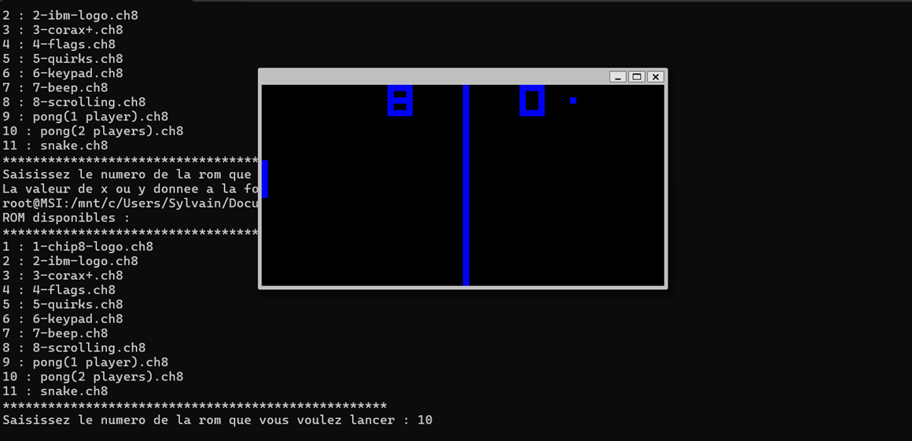
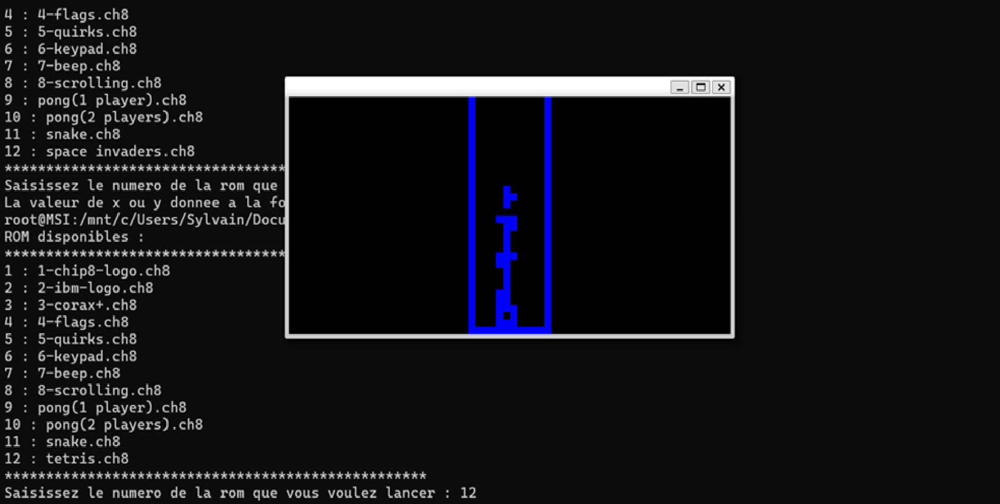

# CHIP-8 emulator

A CHIP-8 emulator written in C capable of running ROMs of classic games (e.g., Pong, Tetris, etc.). 
The implementation includes a full CHIP-8 pipeline and instruction implementation, a virtual CPU, memory management and more.

## Learnings

- Low-level system programming in C
- Emulation of a virtual CPU and instruction set
- Implementation of the fetch–decode–execute pipeline
- Memory management, stack handling, and register design
- Bitwise operations and opcode decoding
- Implementing, debugging and validating behavior against a formal specification

## Features

- Full CHIP-8 instruction set implementation
- CHIP-8 pipeline (fetch, decode, execute)
- Memory
- Stack
- Registers
- Sound
- Sprite rendering

## References

- http://devernay.free.fr/hacks/chip8/C8TECH10.HTM